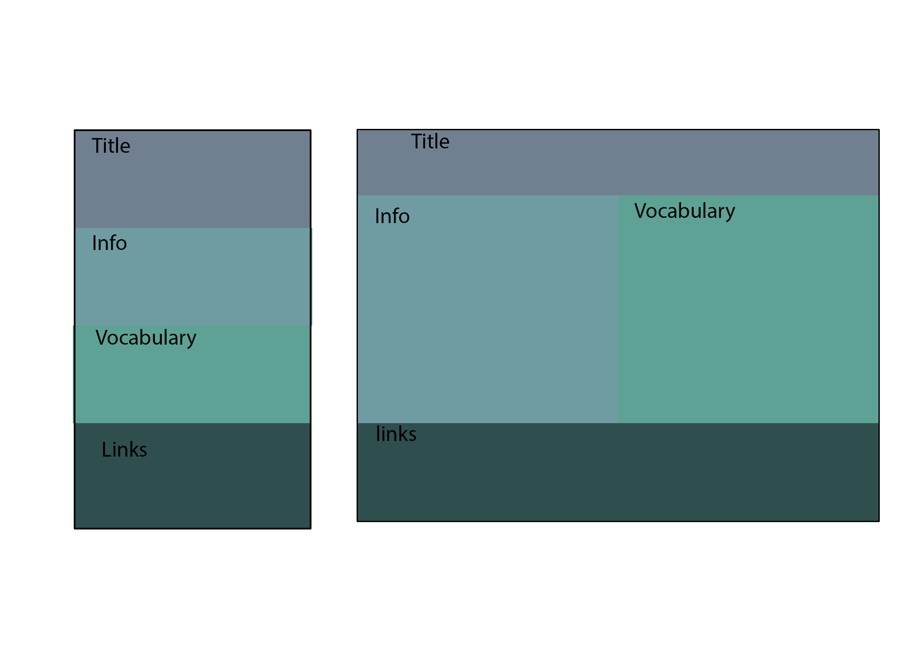

# Week-10hw
Laura Sugiyama
Nick Moles 50

# ReadMe week 10

# Overview

	## What is the information this page tries to deliver?
	
	This page contains information about what responsive web development is, why it is important, and some of the tools used to create it.
	
	
	## What is the first information on the page that should draw the eye?
	The first information that I wanted the eye to be drawn to was the brief description of RWD in the top box.
	
	
	## What is the primary content of the page?
	The primary content of the page is the top three boxes.
	

	## What is the secondary content of the page?
	The secondary content is the list of links in the bottom box

---

# Summary
This week I didn't really add any extra content to my website, as I wanted to really focus on getting the formatting correct and keeping my code cleaner than last weeks assignment.
I think that this paid off as I had a much easier time finding and fixing errors in my code than I have in the past.  This project ended up being one of the first ones that I got through with no major disasters or frusturation and I really enjoyed it! 

---

# Wireframing
The wireframing process was very helpful to me this week. It really helped me get organized before I started writing the code and really helped me with structuring my page.

The wireframing process also helped me to have a very clear idea of what I was going to do, instead of me getting halfway through and realizing that I needed to change something.

---

# Issues
The only issue I had this week was with the middle two boxes.  When I was sizing the page down, they were jumping around and white space was showing at the bottom of one of them.  I fixed this by setting the height for both of the boxes to 'height="auto"' on my style sheet.
